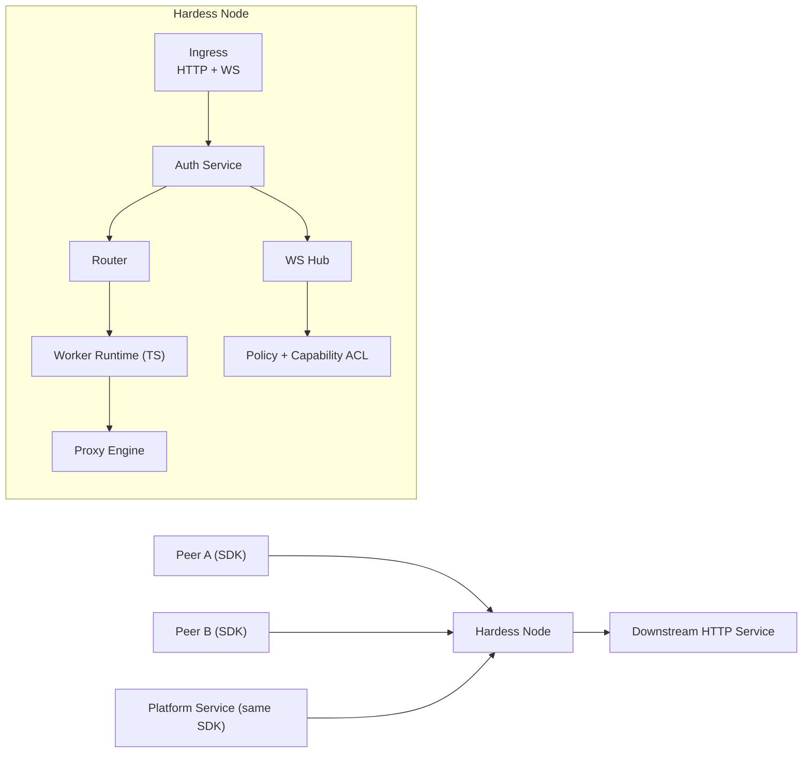
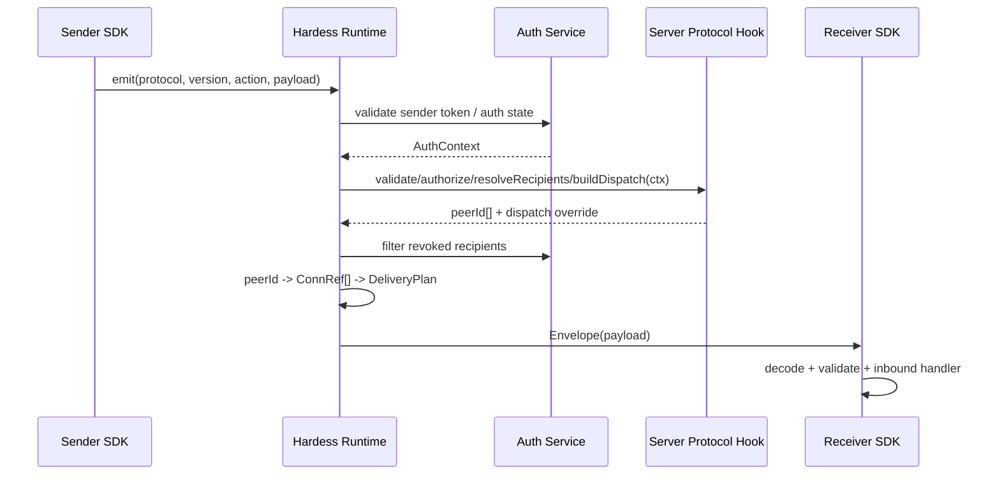

# Hardess Architecture Design (v0.2)

## 1. Background and Problem
Hardess is a gateway + realtime message hub. It solves two core problems:

1. HTTP pre-processing for inbound traffic:
   - Requests can run platform-published trusted TypeScript worker logic first.
   - Worker can mutate request, reject request, or short-circuit response.
   - Then request is forwarded to downstream HTTP service.
2. Realtime communication between connected peers:
   - Direct peer messaging and business-defined audience fanout (client-client / service-service / mixed).
   - System push from platform services over WebSocket.

A key design principle is **transport unification**:
- Connected clients and connected platform services use the same SDK.
- Most connected entities should keep a single long-lived connection.
- Multiple business protocols are multiplexed over that one transport connection.

## 2. Design Principles
1. Cost-first single-node MVP.
2. One runtime path for all connected peers.
3. Stable core protocol + pluggable business protocol.
4. Strict boundaries between system protocol and business protocol.
5. Single-connection multiplexing by default.
6. Evolvable toward multi-node deployment without rewriting application contracts.

## 3. Scope
### In scope (MVP)
1. HTTP gateway with configurable route pipelines.
2. TS worker execution in pre-processing stage.
3. WebSocket hub with direct messaging, audience fanout, and system push.
4. Unified TypeScript SDK for all connected peer types.
5. Dynamic business protocol injection in SDK.

### Out of scope (MVP)
1. Multi-region routing.
2. Persistent offline message storage.
3. Full control plane UI.
4. Exactly-once delivery semantics.

### Current Status
Completed in this document:
1. Core runtime direction is fixed: TypeScript + Bun, single-node MVP, single-connection multiplexing by default.
2. HTTP gateway path is defined: shared auth -> worker -> proxy -> downstream.
3. WebSocket path is defined: shared auth, system/business protocol split, recipient resolution by server hooks, runtime fanout by `peerId -> ConnRef[]`.
4. Core routing model is fixed: Hardess no longer treats `group` as a core routing primitive; business code resolves `peerId[]`.
5. Shared auth model is fixed for HTTP and WebSocket with one `AuthContext` and one revocation path.
6. SDK/server extension model is fixed: client `outbound/inbound` hooks plus server-side `resolveRecipients` and optional dispatch transformation.
7. Worker contract is fixed at the interface level with a Cloudflare-Workers-style `fetch(request, env, ctx)` shape.
8. System message schemas, error codes, shared error body, config schema, and recommended project structure are documented.

Implemented in repository:
1. HTTP gateway main path is running: auth -> worker -> proxy.
2. WebSocket runtime is running on Bun upgrade path with `sys.auth`, `ping/pong`, `route`, `recvAck`, and `handleAck`.
3. Shared auth abstraction, in-memory `PeerLocator`, dispatcher, worker loader, and config store are implemented.
4. Config reload and worker reload work through shadow-copy module loading, and runtime resources expose explicit disposal points.
5. SDK transport, reconnect, heartbeat, protocol registry, conflict detection, and explicit `replace` semantics are implemented.
6. Demo business protocols exist for `demo` and `chat`, including server-side dispatch transformation (`send -> message`).
7. Baseline WebSocket runtime controls now exist: per-peer connection quota enforcement, inbound message rate-limit, bounded outbound queue handling, explicit close-code mapping for auth/protocol/quota/backpressure failures, and cleaner connection rebinding behavior.
8. Basic runtime metrics abstraction is wired in with noop default and WebSocket-side counters for open/close/error/quota/rate-limit/backpressure paths.
9. Tests cover HTTP ingress, WebSocket runtime, worker reload, config reload, SDK transport/client behavior, protocol registries, and routing.

TODO / still open:
1. Add stronger runtime controls beyond the current baseline: real socket backpressure integration, queue/write-buffer governance refinement, and egress flow control tuning.
2. Add observability hardening beyond the current metrics abstraction and console logs: real metrics sinks, dashboards, and alert thresholds.
3. Improve runtime operational polish: config-watch behavior, richer close/error handling, and better local smoke/integration scripts.
4. Keep future distributed `PeerLocator` implementation abstract until scale-out starts.
5. External `AuthProvider` integration is intentionally deferred; the abstraction already exists, but concrete integration should follow the external auth-service contract rather than lead MVP scope.

## 4. High-Level Architecture



## 5. Identity and Connection Model
Hardess separates **logical identity** from **transport connection**.

Core objects:
1. `peerId`: authenticated logical identity.
2. `connId`: unique physical connection id.

Default MVP assumption:
1. One peer normally keeps one active WebSocket connection.
2. That one connection may carry multiple protocols at the same time.
3. Multi-connection peers are allowed later, but are not the primary MVP path.

Identity state:
1. `peerId`: globally unique logical identity.
2. `connId`: unique per connection session.
3. `capabilities`: permission flags assigned at auth time.

Examples of capabilities:
1. `notify.conn` - can send direct notify to a target connection.
2. `push.system` - can send system-level messages.
3. `worker.admin` - can publish/activate worker versions.

Notes:
1. Business recipient resolution targets `peerId[]`; runtime delivery targets `connId`.
2. `peerId` is used for auth, ACL, traceability, and future multi-connection expansion.
3. If multi-connection peer support is enabled later, `peerId -> Set<connId>` becomes an internal index rather than a protocol requirement.

## 6. Data Plane Components
### 6.1 HTTP Ingress + Worker Pipeline
Flow:
1. Match request path to pipeline by prefix.
2. Validate bearer token through the shared auth service.
3. Build worker input context with auth context.
4. Execute worker.
5. Apply worker output:
   - If worker returns `response`, return directly.
   - Else merge request mutations and continue.
6. Forward to configured downstream HTTP endpoint.
7. Return downstream response to caller.

Worker responsibilities:
1. Header/body/path rewrite.
2. Business-level authorization checks using the auth context.
3. Rate-limit hints.
4. AB/gray routing metadata injection.

HTTP proxy contract:
1. Request path/query may be rewritten by worker before forwarding.
2. Request headers are forwarded by default, except hop-by-hop headers and runtime-owned headers.
3. Runtime-owned request headers include authoritative auth/trace metadata injected by Hardess.
4. Request body is buffered in MVP; streaming proxy is out of scope for the first version.
5. Proxy forwarding uses explicit connect timeout and upstream response timeout.
6. Upstream response status/body/headers are returned to caller unless worker short-circuits first.
7. Upstream network failures are mapped to platform-defined gateway error codes.
8. `AuthContext` may be propagated upstream through Hardess-owned headers rather than reusing the client bearer token directly.

### 6.2 WebSocket Hub
Hub responsibilities:
1. Connection lifecycle (`open`, `auth`, `message`, `close`).
2. Peer connection index management.
3. Message routing:
   - direct connection delivery
   - recipient fanout after protocol-specific audience resolution
   - system push
4. Backpressure, rate-limit, heartbeat, and cleanup.

WebSocket auth flow:
1. Validate bearer token through the same shared auth service used by HTTP ingress.
2. Create authenticated connection state only after token validation succeeds.
3. Re-check auth state before outbound send and inbound delivery when token/session revocation is observed.
4. If auth becomes invalid, block both sending and receiving, then close the connection.
5. Default heartbeat policy: send `sys.ping` every `25s`, consider connection stale after `60s` without valid traffic or pong.

Core in-memory indexes (single node):
1. `connById: Map<connId, ConnState>`
2. `connByPeer: Map<peerId, connId>`
3. Future: `connsByPeer: Map<peerId, Set<connId>>`

### 6.3 Shared Authentication Module
Hardess uses one authentication module for both HTTP and WebSocket.

Responsibilities:
1. Validate platform-issued token and load principal data.
2. Produce a shared `AuthContext` used by workers, HTTP proxying, and WebSocket runtime.
3. Resolve `peerId`, capabilities, token expiry, and revocation state.
4. Expose one revocation signal consumed by both HTTP and WebSocket paths.

Auth provider contract:
```ts
interface AuthProvider {
  name: string;
  validateBearerToken(token: string): Promise<AuthContext>;
  validateSystemAuth(payload: unknown): Promise<AuthContext>;
}
```

Shared auth context:
```ts
interface AuthContext {
  peerId: string;
  tokenId: string;
  capabilities: string[];
  expiresAt: number;
  revokedAt?: number;
}
```

Rules:
1. HTTP ingress and WebSocket must call the same validator and build the same `AuthContext`.
2. Worker code receives `AuthContext` as input but does not implement token validation itself.
3. Token revocation semantics are defined once and enforced on both transport paths.
4. `sys.auth` is resolved by dispatching `provider + payload` into the configured `AuthProvider`, not by embedding external auth-service details into the transport protocol.
5. Platform services that need `push.system` use the same shared auth module and must authenticate as service principals with the required capability.

### 6.4 Peer Locator Abstraction
Peer resolution is an internal runtime capability, not a business protocol concern.

```ts
type ConnRef = {
  nodeId: string;
  connId: string;
  peerId: string;
};

interface PeerLocator {
  find(peerId: string): Promise<ConnRef[]>;
  findMany(peerIds: string[]): Promise<Map<string, ConnRef[]>>;
}
```

Rules:
1. All `peerId -> ConnRef[]` expansion must go through `PeerLocator`.
2. MVP uses a local in-memory implementation backed by runtime connection indexes.
3. `ConnRef` always includes `nodeId`, even in single-node mode.
4. Future distributed lookup can replace the implementation without changing protocol hooks or SDK contracts.

## 7. Protocol Model
Hardess protocol is split into two layers:

1. System protocol (platform-defined, strict).
2. Business protocol (user-defined, dynamically injected).

### 7.1 Envelope (shared)
```ts
interface Envelope<T = unknown> {
  msgId: string;
  kind: "system" | "biz";
  src: {
    peerId: string;
    connId: string;
  };
  protocol: string;   // e.g. "sys", "im", "order"
  version: string;    // e.g. "1.0"
  action: string;     // e.g. "notify", "created"
  streamId?: string;  // ordering scope, not a routing key
  seq?: number;       // monotonic within streamId
  ts: number;
  traceId?: string;
  payload: T;
}
```

Rules:
1. `src` is server-authoritative after auth.
2. Business messages do not carry final transport targets in the shared envelope.
3. Recipient resolution is performed server-side by registered protocol hooks.
4. `ts` is for tracing/expiry; ordering is based on `streamId + seq`, not timestamp.

### 7.2 System Message Types (MVP)
1. `sys.auth`
2. `sys.ping` / `sys.pong`
3. `sys.recvAck`
4. `sys.handleAck`
5. `sys.err`
6. `sys.route`
7. `sys.push`

System semantics:
1. `sys.recvAck`: the platform accepted the message into the target transport path.
2. `sys.handleAck`: the target-side business handler completed successfully.
3. `sys.route`: server-side transport control derived from protocol-specific recipient resolution.

Rules:
1. `kind=system` can only be handled by built-in handlers.
2. User plugins cannot override system handlers.

### 7.2.1 System Message Schemas
```ts
interface SysAuthPayload {
  provider: string;
  payload: unknown;
}

interface SysAuthOkPayload {
  peerId: string;
  capabilities: string[];
  expiresAt: number;
}

interface SysPingPayload {
  nonce?: string;
}

interface SysPongPayload {
  nonce?: string;
}

interface SysRecvAckPayload {
  ackFor: string;      // msgId
  acceptedAt: number;
}

interface SysHandleAckPayload {
  ackFor: string;      // msgId
  handledAt: number;
}

interface SysErrPayload {
  code: string;
  message: string;
  retryable: boolean;
  detail?: unknown;
  refMsgId?: string;
}

interface SysRoutePayload {
  resolvedPeers: string[];
  deliveredConns: Array<{
    nodeId: string;
    connId: string;
    peerId: string;
  }>;
}

interface SysPushPayload<T = unknown> {
  topic: string;
  payload: T;
}
```

Message notes:
1. `sys.auth` request uses `SysAuthPayload`; success response uses `SysAuthOkPayload`.
2. `sys.recvAck` and `sys.handleAck` both point back to business `msgId` by `ackFor`.
3. `sys.err.refMsgId` links an error to the original system or business message.
4. `sys.route` is runtime-generated metadata and not emitted by business plugins directly.
5. The exact `sys.auth` handshake is intentionally abstract in this document because it depends on the external platform auth service contract.

### 7.2.2 System Error Codes
Minimum MVP error code set:
1. `AUTH_INVALID_TOKEN`
2. `AUTH_EXPIRED_TOKEN`
3. `AUTH_REVOKED_TOKEN`
4. `ACL_DENIED`
5. `CONN_QUOTA_EXCEEDED`
6. `RATE_LIMIT_EXCEEDED`
7. `BACKPRESSURE_OVERFLOW`
8. `PROTO_REGISTRATION_CONFLICT`
9. `PROTO_UNKNOWN_ACTION`
10. `PROTO_INVALID_PAYLOAD`
11. `ROUTE_NO_RECIPIENT`
12. `ROUTE_PEER_OFFLINE`
13. `ROUTE_DELIVERY_TIMEOUT`
14. `GATEWAY_UPSTREAM_TIMEOUT`
15. `GATEWAY_UPSTREAM_UNAVAILABLE`
16. `INTERNAL_ERROR`

Rules:
1. Error codes are stable protocol contracts; `message` is human-readable but non-contractual.
2. WebSocket close reasons should map to the same auth/error code family where applicable.
3. HTTP proxy failures and WebSocket runtime failures share the same error code namespace when they originate from the same platform concern.

Default WebSocket close mapping (current baseline):
1. `4400` -> invalid protocol payload
2. `4401` -> auth invalid / expired / revoked
3. `4403` -> ACL denied
4. `4408` -> heartbeat timeout
5. `4429` -> connection quota exceeded / message rate-limit exceeded
6. `4508` -> outbound backpressure / queue overflow

### 7.2.3 Shared Error Response Shape
HTTP and WebSocket share one platform error body shape even though the transport framing differs.

```ts
interface PlatformErrorBody {
  error: {
    code: string;
    message: string;
    retryable: boolean;
    traceId?: string;
    refMsgId?: string;
    detail?: unknown;
  };
}
```

Transport mapping:
1. HTTP returns `application/json` with `PlatformErrorBody` and the mapped HTTP status code.
2. WebSocket system errors use `sys.err.payload` with the same field set as `PlatformErrorBody.error`.
3. WebSocket close frames should carry the closest matching code/reason when the connection must be terminated.

Minimum HTTP status mapping:
1. `AUTH_INVALID_TOKEN`, `AUTH_EXPIRED_TOKEN`, `AUTH_REVOKED_TOKEN` -> `401`
2. `ACL_DENIED` -> `403`
3. `PROTO_INVALID_PAYLOAD` -> `400`
4. `ROUTE_NO_RECIPIENT`, `ROUTE_PEER_OFFLINE` -> `404`
5. `ROUTE_DELIVERY_TIMEOUT`, `GATEWAY_UPSTREAM_TIMEOUT` -> `504`
6. `GATEWAY_UPSTREAM_UNAVAILABLE` -> `503`
7. `INTERNAL_ERROR` -> `500`

Minimum WebSocket close code mapping:
1. `AUTH_INVALID_TOKEN`, `AUTH_EXPIRED_TOKEN`, `AUTH_REVOKED_TOKEN` -> `4401`
2. `ACL_DENIED` -> `4403`
3. `PROTO_INVALID_PAYLOAD` -> `4400`
4. `INTERNAL_ERROR` -> `1011`
5. Route-level errors such as `ROUTE_NO_RECIPIENT` and `ROUTE_PEER_OFFLINE` return `sys.err` without closing the connection by default.

### 7.3 Business Message Types
1. `kind=biz`
2. Routed through protocol registry by `protocol + version + action`.
3. Payload schema validated by plugin-provided validators.
4. Multiple business protocols can share one transport connection.

## 8. SDK Architecture (Single SDK for All Peers)
The same SDK package is used by all peer implementations.

SDK layers:
1. `Transport`:
   - WebSocket connect/reconnect/heartbeat.
   - one connection carrying multiple protocols
2. `Core`:
   - Envelope encode/decode
   - request-response correlation (ack)
   - stream ordering by `streamId + seq`
   - retry policy hooks
3. `ProtocolRegistry`:
   - dynamic plugin registration
4. `Runtime API`:
   - send, subscribe, middleware, lifecycle hooks

### 8.1 Client Protocol Contract
```ts
export interface ClientProtocolModule<Out = unknown, In = unknown> {
  protocol: string;
  version: string;
  outbound?: {
    encode?: (action: string, payload: Out) => unknown;
    actions?: Record<string, (ctx: OutboundContext<Out>) => unknown>;
  };
  inbound?: {
    decode?: (action: string, payload: unknown) => In;
    validate?: (action: string, payload: In) => void;
    actions?: Record<string, (ctx: InboundContext<In>) => Promise<void> | void>;
  };
}

export interface OutboundContext<Payload = unknown> {
  protocol: string;
  version: string;
  action: string;
  payload: Payload;
  auth?: Pick<AuthContext, "peerId" | "capabilities" | "expiresAt">;
  traceId?: string;
  setStream(streamId: string): void;
}

export interface InboundContext<Payload = unknown> {
  protocol: string;
  version: string;
  action: string;
  payload: Payload;
  src: {
    peerId: string;
    connId: string;
  };
  traceId?: string;
  ts: number;
}
```

### 8.2 Dynamic Injection API
```ts
sdk.use(module);
sdk.unuse({ protocol: "im", version: "1.0" });
sdk.replace(module);
```

Constraints:
1. Plugins can only handle `kind=biz` messages.
2. Plugin action conflict is rejected unless explicit `replace`.
3. Plugin failure must not break connection loop.
4. Plugins share a transport connection but must not assume cross-protocol ordering.

### 8.3 Server Protocol Hook Contract
Business recipient resolution runs inside Hardess, not inside the client SDK.

```ts
export interface ServerProtocolModule<Payload = unknown> {
  protocol: string;
  version: string;
  actions: Record<string, ServerActionHooks<Payload>>;
}

export interface ServerActionHooks<Payload = unknown> {
  validate?: (ctx: ServerHookContext<Payload>) => Promise<void> | void;
  authorize?: (ctx: ServerHookContext<Payload>) => Promise<void> | void;
  resolveRecipients?: (
    ctx: ServerHookContext<Payload>
  ) => Promise<string[]> | string[];
  buildDispatch?: (
    ctx: ServerHookContext<Payload>
  ) => Promise<ServerDispatch | void> | ServerDispatch | void;
}

export interface ServerHookContext<Payload = unknown> {
  protocol: string;
  version: string;
  action: string;
  payload: Payload;
  auth: AuthContext;
  traceId?: string;
  ts: number;
}

export interface ServerDispatch {
  protocol?: string;
  version?: string;
  action?: string;
  payload?: unknown;
  streamId?: string;
  ack?: "none" | "recv" | "handle";
}
```

Rules:
1. `resolveRecipients(ctx)` returns `peerId[]`, not `connId[]`.
2. Business code decides recipients from payload and business context.
3. `buildDispatch(ctx)` may rewrite the outbound business action/payload before fanout.
4. `ServerHookContext` includes the shared `AuthContext`.
5. Hardess runtime owns the `peerId -> ConnRef[]` index and final transport fanout.

### 8.4 Runtime Dispatch Pipeline
Internal runtime types:

```ts
interface DeliveryPlan {
  targets: ConnRef[];
  streamId?: string;
  ack: "none" | "recv" | "handle";
}
```

Execution flow:
1. Sender SDK emits a business message.
2. Hardess verifies sender auth state from the shared auth module.
3. Hardess matches `protocol + version + action`.
4. Hardess runs `validate`, `authorize`, `resolveRecipients`, and optional `buildDispatch`.
5. `resolveRecipients` returns `peerId[]`.
6. `buildDispatch` may rewrite `action`, `payload`, `streamId`, and `ack` mode for receiver-side delivery.
7. Hardess filters out recipients whose auth state is invalid or revoked.
8. Hardess expands valid `peerId[]` into online `ConnRef[]`.
9. Hardess builds `DeliveryPlan` and dispatches over WebSocket.
10. Receiver SDK decodes and handles the inbound business message.

### 8.5 End-to-End Flow


## 9. Runtime and Tech Stack
Hardess MVP runtime is **TypeScript + Bun**.

Runtime choices:
1. Server runtime: Bun running native TypeScript/ESM entrypoints.
2. Network ingress: Bun-native HTTP and WebSocket serving on the same runtime path.
3. SDK and server hooks: authored in TypeScript and loaded as ESM modules.
4. Worker execution: TypeScript workers compiled/loaded within the Bun runtime.

Constraints:
1. Runtime-facing modules should target ESM only in MVP.
2. Runtime-owned APIs should prefer Web-standard request/response primitives where Bun already provides them.
3. Bun-specific behavior should be isolated to runtime adapters so protocol and SDK contracts remain portable.

## 10. Worker Runtime Design
For TypeScript + Bun MVP:
1. Compile worker TS at load time.
2. Cache by file hash/version.
3. Execute with timeout guard.
4. Workers are platform-managed trusted extensions, not tenant-supplied sandboxed code.

### 10.1 Worker Module Contract
Worker shape follows a Cloudflare-Workers-style `fetch(request, env, ctx)` contract, adapted for Hardess proxy control.

```ts
export interface HardessWorkerEnv {
  auth: AuthContext;
  pipeline: {
    id: string;
    matchPrefix: string;
    downstreamOrigin: string;
  };
  traceId?: string;
}

export interface HardessExecutionContext {
  waitUntil(promise: Promise<unknown>): void;
}

export interface HardessWorkerResult {
  request?: Request;   // replacement request to proxy upstream
  response?: Response; // short-circuit response
}

export interface HardessWorkerModule {
  fetch(
    request: Request,
    env: HardessWorkerEnv,
    ctx: HardessExecutionContext
  ): Promise<Response | HardessWorkerResult | void> | Response | HardessWorkerResult | void;
}
```

Rules:
1. Worker input uses standard Web `Request` and `Response` objects.
2. Request mutation is represented by returning a replacement `Request`, not by mutating the original request in place.
3. Returning `Response` or `{ response }` short-circuits proxy forwarding.
4. Returning `{ request }` continues upstream proxying with the replacement request.
5. `ctx.waitUntil()` is allowed for side effects such as async logging, but it must not delay the main request path.

### 10.2 Worker Runtime API Boundary
Allowed APIs in MVP:
1. Web-standard `Request`, `Response`, `Headers`, `URL`, `fetch`, `crypto`, `TextEncoder`, `TextDecoder`.
2. `ctx.waitUntil()` for fire-and-forget side effects.
3. Structured logging through a runtime-provided logger exposed on worker env in future extensions.

Disallowed or deferred APIs in MVP:
1. Direct access to process-wide mutable state as a contract assumption.
2. Arbitrary filesystem access from worker code.
3. Arbitrary environment variable reads from worker code.
4. Built-in KV/cache/database bindings in the first version.
5. Long-lived background tasks that outlive the request lifecycle except via controlled `waitUntil()`.

Rules:
1. `fetch` is allowed for controlled outbound calls, but its usage should remain observable and subject to timeout policy.
2. Worker code should treat platform services such as KV/cache as explicit future bindings, not ambient globals.
3. If future bindings are added, they should be injected through `env` rather than accessed implicitly from the runtime.

Input:
1. method/path/query/headers/body
2. peer identity info (if authenticated)
3. pipeline metadata

Output:
1. `request` mutations
2. optional short-circuit `response`

Failure handling:
1. Worker timeout returns a gateway error and emits structured logs/metrics.
2. Worker exception does not crash the process or break unrelated requests.
3. Config/worker reload only affects new requests; in-flight requests continue on the version they started with.
4. Invalid updated worker/config keeps the previous active version.
5. MVP worker execution remains in the same Bun process; fault containment is contractually provided by timeout, exception capture, and non-shared request context rather than process isolation.

Future hardening:
1. better isolate boundaries for fault containment
2. memory quotas
3. external dependency control

## 11. Security Model
1. One shared auth module validates platform-issued token for both HTTP and WebSocket.
2. Auth handshake required before WebSocket business actions.
3. HTTP forwarding requires valid token before worker execution and proxy forwarding.
4. Capability ACL check before route/fanout operations.
5. Server sets authoritative `src` field.
6. Revoked or expired token blocks both outbound send and inbound delivery on WebSocket.
7. Revoked or expired token causes HTTP request rejection before proxy forwarding.
8. Message size limits.
9. Per-connection and per-peer rate limits.
10. Heartbeat timeout cleanup.
11. Structured audit logs with trace ID.

## 12. Reliability and Observability
### Reliability
1. At-least-once delivery for online connections.
2. `recvAck` and `handleAck` have distinct timeout policies.
3. Idempotency guidance via `msgId`.
4. Ordering is only defined within the same `streamId`.
5. No offline retention or replay is provided in MVP; offline targets return route-level errors.

Default runtime policies:
1. `recvAck` timeout: `5s`
2. `handleAck` timeout: `15s`
3. recommended reconnect backoff for SDK: exponential backoff starting at `500ms`, capped at `10s`

### Observability
1. Metrics:
   - active connections
   - message in/out rate
   - fanout count
   - worker latency/error rate
2. Logs:
   - `traceId`, `msgId`, `peerId`, `action`, `latencyMs`, `result`

## 13. Config Model (MVP)
Gateway config file structure:

```ts
interface HardessConfig {
  pipelines: PipelineConfig[];
}

interface PipelineConfig {
  id: string;
  matchPrefix: string;
  auth?: {
    required: boolean;
  };
  downstream: {
    origin: string;
    connectTimeoutMs: number;
    responseTimeoutMs: number;
    forwardAuthContext?: boolean;
    injectedHeaders?: Record<string, string>;
  };
  worker?: {
    entry: string;
    timeoutMs: number;
  };
}
```

Example:
```json
{
  "pipelines": [
    {
      "id": "demo-http",
      "matchPrefix": "/demo",
      "auth": {
        "required": true
      },
      "downstream": {
        "origin": "http://127.0.0.1:9000",
        "connectTimeoutMs": 1000,
        "responseTimeoutMs": 5000,
        "forwardAuthContext": true,
        "injectedHeaders": {
          "x-hardess-pipeline": "demo-http"
        }
      },
      "worker": {
        "entry": "workers/demo-worker.ts",
        "timeoutMs": 50
      }
    }
  ]
}
```

Behavior:
1. Match longest prefix first.
2. Hot reload on config file change.
3. Keep previous valid config if new config invalid.
4. New config only applies to new requests/connections.
5. Runtime-owned header injection is configured centrally, not by arbitrary client input.

## 14. Recommended Project Structure
One practical TypeScript + Bun layout for MVP:

```text
hardess/
  docs/
  src/
    runtime/
      server.ts
      ingress/
        http.ts
        websocket.ts
      auth/
        service.ts
        context.ts
      routing/
        peer-locator.ts
        dispatcher.ts
      protocol/
        envelope.ts
        system-handlers.ts
        registry.ts
      proxy/
        upstream.ts
      workers/
        loader.ts
        runner.ts
        types.ts
      observability/
        logger.ts
        metrics.ts
    sdk/
      transport/
      protocol/
      runtime/
      index.ts
    shared/
      errors.ts
      codes.ts
      types.ts
  workers/
    demo-worker.ts
  config/
    hardess.config.ts
```

Responsibility split:
1. `src/runtime/` owns HTTP ingress, WebSocket hub, auth integration, recipient expansion, proxying, and worker execution.
2. `src/sdk/` owns client-side transport, protocol registration, outbound/inbound runtime APIs, and reconnection behavior.
3. `src/shared/` owns transport-neutral contracts such as error codes, envelope types, and shared utility types.
4. Top-level `workers/` contains platform-managed worker modules loaded by the runtime.
5. Top-level `config/` contains deploy/runtime configuration rather than protocol code.

Rules:
1. Runtime-only Bun integrations should stay under `src/runtime/` so shared contracts remain portable.
2. SDK should not import runtime-only modules.
3. Worker-facing types should be exported from a stable runtime contract module, not copied ad hoc into worker files.

## 15. Roadmap
### Phase 0 (completed)
1. Finalized architecture and protocol contracts.

### Phase 1 (implemented single-node MVP baseline)
1. HTTP worker pre-processing + proxy.
2. WS hub direct messaging + audience fanout + system push baseline.
3. Unified SDK core + plugin registry.
4. Config reload and worker reload baseline.
5. Demo business protocols and local smoke/demo tooling.
6. Baseline WS connection quota, inbound rate-limit, bounded outbound queue, and close-code behavior.

### Phase 2 (hardening)
1. Better worker isolation and quotas.
2. Better backpressure, rate-limit, and queue/write-buffer controls.
3. Metrics sinks, dashboard, and alert thresholds.
4. Better lifecycle handling for runtime/watch/reload behavior.

### Phase 3 (scale-out)
1. Redis pub/sub adapter for multi-node fanout.
2. Sticky session and consistent routing strategy.
3. Control plane for route/worker version management.
4. Distributed `PeerLocator` backend.

## 16. Open Decisions
1. Future distributed `PeerLocator` backend selection after scale-out begins.
2. Whether peer-target routing should be added after multi-connection semantics are finalized.
3. Whether Phase 2 should introduce stronger worker isolation via process/isolate boundaries.
4. When a real external auth-service contract is stable, how `AuthProvider` should map remote revocation and expiry semantics into the local `AuthContext`.

## 17. Summary
Hardess adopts a **single-connection, multi-protocol architecture** with:
1. one gateway runtime,
2. one unified transport envelope with explicit routing semantics,
3. one shared SDK for all connected peers,
4. pluggable business protocol injection,
5. trusted platform workers in the HTTP pipeline,
6. single-node-first cost optimization with clear multi-node evolution path.
