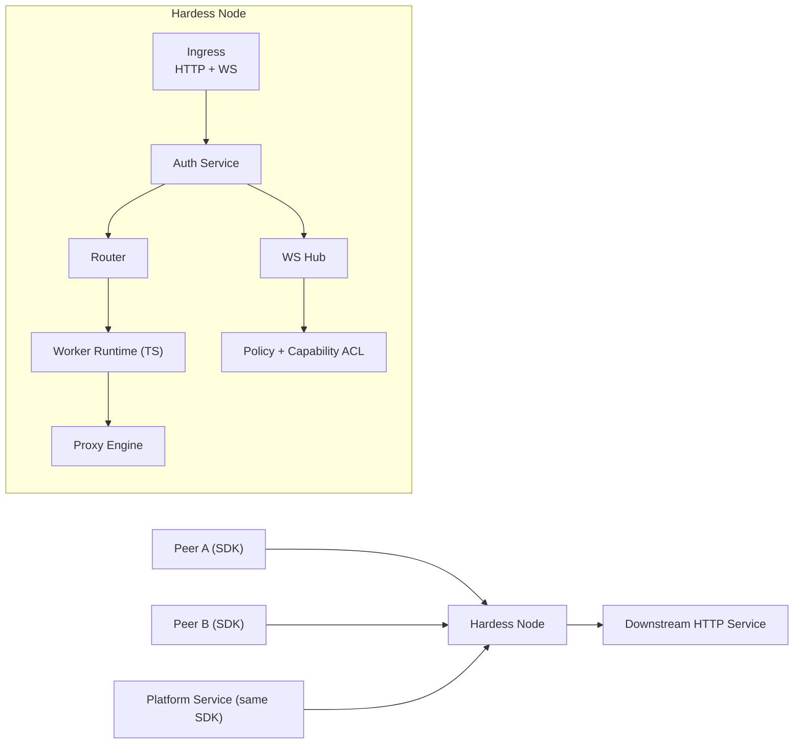
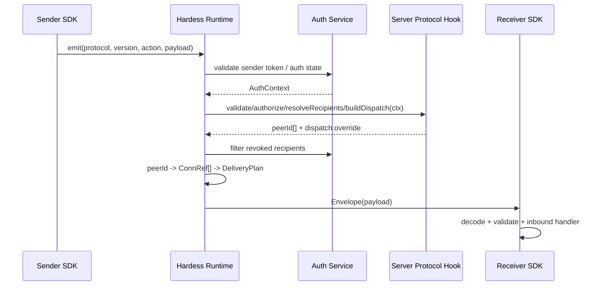

# Hardess Architecture Design (v0.2)

## 1. Background and Problem
Hardess is a gateway + realtime message hub. It solves two core problems:

1. HTTP pre-processing for inbound traffic:
   - Requests can run platform-published trusted TypeScript worker logic first.
   - Worker can mutate request, reject request, or short-circuit response.
   - Then request is forwarded to downstream HTTP service.
2. Realtime communication between connected peers:
   - Direct peer messaging and business-defined audience fanout (client-client / service-service / mixed).
   - A reserved system-push extension point over WebSocket for future runtime-level control events; business push should use injected business protocols.

A key design principle is **transport unification**:
- Connected clients and connected platform services use the same SDK.
- Most connected entities should keep a single long-lived connection.
- Multiple business protocols are multiplexed over that one transport connection.

## 2. Design Principles
1. Cost-first single-node MVP.
2. One runtime path for all connected peers.
3. Stable core protocol + pluggable business protocol.
4. Strict boundaries between system protocol and business protocol.
5. Single-connection multiplexing by default.
6. Evolvable toward multi-node deployment without rewriting application contracts.

## 3. Scope
### In scope (MVP)
1. HTTP gateway with configurable route pipelines.
2. TS worker execution in pre-processing stage.
3. WebSocket hub with direct messaging, audience fanout, plus a reserved system-push extension point that is not part of the current runtime baseline.
4. Unified TypeScript SDK for all connected peer types.
5. Dynamic business protocol injection in SDK.

### Out of scope (MVP)
1. Multi-region routing.
2. Persistent offline message storage.
3. Full control plane UI.
4. Exactly-once delivery semantics.

### Current Status
Completed in this document:
1. Core runtime direction is fixed: TypeScript + Bun, single-node MVP, single-connection multiplexing by default.
2. HTTP gateway path is defined: shared auth -> worker -> proxy -> downstream.
3. WebSocket path is defined: shared auth, system/business protocol split, recipient resolution by server hooks, runtime fanout by `peerId -> ConnRef[]`.
4. Core routing model is fixed: Hardess no longer treats `group` as a core routing primitive; business code resolves `peerId[]`.
5. Shared auth model is fixed for HTTP and WebSocket with one `AuthContext` and one revocation path.
6. SDK/server extension model is fixed: client `outbound/inbound` hooks plus server-side `resolveRecipients` and optional dispatch transformation.
7. Worker contract is fixed at the interface level with a Cloudflare-Workers-style `fetch(request, env, ctx)` shape.
8. System message schemas, error codes, shared error body, config schema, and recommended project structure are documented.

Implemented in repository:
1. HTTP gateway main path is running: auth -> worker -> proxy.
2. WebSocket runtime is running on Bun upgrade path with `sys.auth`, `ping/pong`, `route`, `recvAck`, and `handleAck`.
3. Shared auth abstraction, dispatcher, worker loader, config store, and both local plus static-cluster `PeerLocator` implementations are implemented.
4. Config reload and worker reload work through shadow-copy module loading, directory-level watch with debounce, serialized reload execution, and explicit disposal points.
5. SDK transport, reconnect, heartbeat, protocol registry, conflict detection, and explicit `replace` semantics are implemented.
6. Demo business protocols exist for `demo` and `chat`, including server-side dispatch transformation (`send -> message`) and a baseline capability check for the built-in direct-notify-style send actions.
7. Baseline WebSocket runtime controls now exist: per-peer connection quota enforcement, inbound message rate-limit, bounded outbound queue handling, explicit close-code mapping for auth/protocol/quota/backpressure failures, stricter protocol-violation close behavior, and cleaner connection rebinding behavior.
8. Runtime metrics now include bounded snapshot support for server mode, HTTP/worker/proxy/WebSocket-side counters and timings, cluster-transport counters for internal WS channels, threshold-based structured alert logging over configurable windows, and Prometheus text export for external scraping.
9. Runtime admin endpoints now exist for `__admin/health`, `__admin/ready`, `__admin/metrics`, `__admin/metrics/prometheus`, and `__admin/cluster/peers`, and the Bun server path supports graceful shutdown signaling with an explicit drain window before stop/dispose.
10. The runtime server now supports an optional dual-listener deployment shape: one shared `RuntimeApp` can serve a business listener and a control listener simultaneously, with optional per-listener path-prefix policies, compatibility aliases for older `public/internal` naming, and permissive defaults when those policies are unset.
11. Local operator tooling now includes HTTP/WS load scripts, an automated local release-gate runner with optional or profile-driven SLO thresholds, optional Toxiproxy weak-network simulation, repo-level workflow entrypoints, tuned single-node plus cluster high-load benchmark profiles with optional or profile-driven SLO thresholds, a small operator guide, a sample Prometheus scrape config, and a sample Grafana dashboard template.
12. Static multi-node routing baseline is now implemented with per-node local connection indexes, cached remote peer lookup, HTTP-based peer locate, a long-lived control-channel WebSocket between configured cluster peers for cross-node delivery and `handleAck` forwarding, and an explicit HTTP fallback transport mode.
13. A shared runtime-schema baseline is now implemented with `zod` for config validation, config/worker module export boundaries, shared envelope validation, key system payloads, cluster env/control HTTP/admin response validation, business protocol payloads, and worker result validation.
14. SDK transport now exposes structured close/error events and avoids reconnecting on terminal server close codes such as auth/policy/quota/backpressure failures.
15. SDK sender-side delivery surfaces are now implemented with split transport/protocol errors, a global delivery event stream, per-message tracked sends, immediate tracked-send failure on transport close, sender-visible delivery timeouts, and higher-level `waitForResult()` / `client.send(...)` helpers for common business code.
16. Tests cover HTTP ingress, WebSocket runtime, local and distributed routing, worker reload, config reload, SDK transport/client behavior, protocol registries, runtime admin endpoints, timeout mapping, listener-policy behavior, and schema validation boundaries.

Implementation checklist by module:

Completed:
1. Shared contracts and envelope model are implemented and reused by runtime, SDK, and workers.
2. HTTP ingress main path is implemented: route match, shared auth, worker execution, proxy forwarding, and unified error mapping.
3. Worker runtime baseline is implemented: stable worker contract, module loading, timeout guard, shadow-copy reload, and explicit invalidation/disposal points.
4. WebSocket runtime baseline is implemented: auth handshake, heartbeat, direct routing, server-side recipient expansion, recv/handle ack flow, and close/error mapping.
5. WebSocket safety baseline is implemented: per-peer connection quota, inbound rate-limit, bounded outbound queue, invalid-envelope close behavior, and connection rebinding cleanup.
6. SDK baseline is implemented: protocol registry, outbound/inbound hooks, reconnect, heartbeat, structured close/error callbacks, and terminal-close no-reconnect behavior.
7. Demo protocol path is implemented end-to-end for `demo` and `chat`, including server-side dispatch transformation.
8. Config/runtime lifecycle baseline is implemented: config watch with debounce, serialized reload execution, worker invalidation on config changes, and runtime disposal wiring.
9. Runtime-schema baseline is implemented for config, shared envelope parsing, key system payloads, business protocol payloads, and worker return-contract validation.
10. Runtime operational baseline is implemented for health/readiness/metrics endpoints, graceful shutdown signaling, and local load-testing tooling.
11. Test baseline is implemented across HTTP ingress, WebSocket runtime, config reload, worker reload, SDK transport/client behavior, protocol registries, routing, admin endpoints, timeout mapping, and schema behavior.

Partially completed:
1. Observability is partially implemented: bounded metrics snapshots, threshold-based structured alert logging, admin metrics snapshots, Prometheus text export, and a sample Grafana dashboard template now exist, but external monitoring stack rollout still needs environment integration work.
2. Auth integration is partially implemented: the shared `AuthService` abstraction, provider dispatch, expiry checks, and revocation path exist, but only the local demo provider is wired today.
3. WebSocket backpressure and egress governance are partially implemented: Bun send-status handling, bounded queueing, socket buffered-amount limits, retry-on-backpressure, and overflow close behavior now exist, but deeper transport-specific flow-control tuning may still be needed under heavier production traffic.
4. Runtime operational polish is partially implemented: config/worker reload, health/readiness, graceful shutdown with drain window, startup-failure handling, repo-level workflow docs, an operator guide, automated local release-gate execution, SLO-aware release-gate checks, and SLO-aware cluster benchmarking are in place, but broader deployment integration is still environment-specific.
5. Multi-node scalability boundaries are partially implemented: a distributed `PeerLocator`, cached remote lookup, HTTP locate, control-WebSocket-based cross-node delivery / handle-ack forwarding, an HTTP fallback transport mode, and admin-projected topology narrowing now exist, but stronger runtime health coordination is still intentionally simple.
6. Runtime-schema standardization is partially implemented: the highest-value boundaries now use a shared schema layer, including cluster env and control HTTP/admin response parsing plus the worker-module export boundary, but a small tail still remains in the hot-path envelope fast parser and a few runtime helper guards.
7. ACL / capability enforcement is partially implemented: the `authorize` hook exists and the built-in `demo.send` / `chat.send` path now requires `notify.conn`, but a broader default capability policy for future injected protocols is still open.
8. Some SDK ergonomics remain intentionally thin above the current sender-side delivery baseline: `emit`, `emitTracked`, `waitForResult`, and `send` now cover the common cases, but request/reply-style business abstractions are still protocol-level decisions rather than a fixed core contract.

Not started or intentionally deferred:
1. External `AuthProvider` integration is intentionally deferred until the external auth-service contract is stable.
2. Stronger worker isolation beyond same-process Bun execution is deferred to Phase 2.
3. Persistent offline storage, replay, and exactly-once semantics are out of MVP scope and not started.
4. Gossip-style health convergence, shared distributed routing state, and other stronger scale-out coordination are deferred beyond the current admin-projected multi-node baseline.
5. Control plane route/worker version management UI is out of MVP scope and not started.

TODO / still open:
1. High priority: extend the shared runtime-schema layer across the remaining small tail of ad hoc validation, especially future control-plane inputs plus the few remaining runtime helper guards outside the intentionally hand-rolled hot-path envelope parser.
2. High priority: continue tuning WebSocket egress and backpressure controls under broader traffic mixes. The baseline safeguards exist, and the repo now has a repeatable single-node stair-step benchmark for that work, but the thresholds still need production-like calibration.
3. Medium priority: define and calibrate cluster latency / degradation SLOs per deployment tier. The benchmark runner and release gates now support layered built-in `local` / `high` envelopes plus explicit overrides, but the acceptable envelope is still workload-specific.
4. Medium priority: finish observability environment integration beyond the current bounded metrics, threshold-log, and Prometheus-export baseline.
5. Medium priority: improve deployment automation and runtime operational polish beyond the current local release-gate and graceful-shutdown baseline.
6. Lower priority: decide whether the admin-projected cluster baseline should gain a gossip health overlay, shared registry support, or broader service-discovery-backed peer inputs once scale-out requirements are clearer.
7. Deferred by dependency: external `AuthProvider` integration should follow the external auth-service contract rather than lead MVP scope.
8. Deferred pending upstream standard: finish the default ACL / capability policy for injected protocol actions. The hook exists and built-in direct-notify-style actions now enforce `notify.conn`, but the broader policy should wait for the upstream integration contract rather than churn locally.

Single-node release checklist:

Must complete before single-node production release:
1. Replace the demo auth path with a real `AuthProvider` integration and validate both HTTP bearer auth and WebSocket `sys.auth` against the same production authority.
2. Keep the current proxy timeout split validated under realistic weak-network scenarios so connect timeout and upstream response timeout stay aligned with config semantics in production.
3. Expose production-usable observability for the main paths: request volume, error rate, upstream timeout/unavailable counts, worker error/latency, and WebSocket open/close/error/quota/backpressure signals are now emitted in-process and exported for Prometheus scraping, but external stack rollout still depends on deployment.
4. Finish the deployment lifecycle story beyond the current baseline: health/readiness checks, explicit drain-before-stop behavior, and startup failure handling now exist, but rollout-specific orchestration expectations still need environment documentation.
5. The local smoke/load scripts are now wrapped in an automated local release-gate flow, but realistic deployment-specific gates still need environment integration.

Recommended before first release:
1. Validate the new WebSocket egress governance under wider production traffic mixes, especially around socket backpressure thresholds and retry timing.
2. Keep the operator guide current as deployment conventions stabilize.
3. Calibrate threshold-based log monitoring for upstream timeout spikes, worker failures, and WebSocket overflow/rate-limit events against production traffic.
4. Review worker trust and change-management boundaries so only expected worker modules can be published and activated in the single-node deployment.

Current implementation priority after deferring external auth integration:
1. Continue migrating mixed validation paths onto the shared runtime-schema layer.
2. Validate and tune WebSocket egress / backpressure thresholds under broader traffic mixes.
3. Keep observability and release-gate wiring production-usable per environment.
4. Keep the default ACL / capability policy for injected protocols deferred until the upstream integration contract is stable.

Can defer for single-node release:
1. Gossip health overlay, stronger distributed routing state, and other scale-out architecture work beyond the current admin-projected cluster baseline.
2. Stronger worker isolation via process or isolate boundaries.
3. Persistent offline storage, replay, and exactly-once delivery semantics.
4. Control-plane route/worker version management UI.

## 4. High-Level Architecture



## 5. Identity and Connection Model
Hardess separates **logical identity** from **transport connection**.

Core objects:
1. `peerId`: authenticated logical identity.
2. `connId`: unique physical connection id.

Default MVP assumption:
1. One peer normally keeps one active WebSocket connection.
2. That one connection may carry multiple protocols at the same time.
3. Multi-connection peers are allowed later, but are not the primary MVP path.

Identity state:
1. `peerId`: globally unique logical identity.
2. `connId`: unique per connection session.
3. `capabilities`: permission flags assigned at auth time.

Examples of capabilities:
1. `notify.conn` - can send direct notify to a target connection.
2. `push.system` - can send system-level messages.
3. `worker.admin` - can publish/activate worker versions.

Notes:
1. Business recipient resolution targets `peerId[]`; runtime delivery targets `connId`.
2. `peerId` is used for auth, ACL, traceability, and future multi-connection expansion.
3. If multi-connection peer support is enabled later, `peerId -> Set<connId>` becomes an internal index rather than a protocol requirement.

## 6. Data Plane Components
### 6.1 HTTP Ingress + Worker Pipeline
Flow:
1. Match request path to pipeline by prefix.
2. Validate bearer token through the shared auth service.
3. Build worker input context with auth context.
4. Execute worker.
5. Apply worker output:
   - If worker returns `response`, return directly.
   - Else merge request mutations and continue.
6. Forward to configured downstream HTTP endpoint.
7. Return downstream response to caller.

Worker responsibilities:
1. Header/body/path rewrite.
2. Business-level authorization checks using the auth context.
3. Rate-limit hints.
4. AB/gray routing metadata injection.

HTTP proxy contract:
1. Request path/query may be rewritten by worker before forwarding.
2. Request headers are forwarded by default, except hop-by-hop headers and runtime-owned headers.
3. Runtime-owned request headers include authoritative auth/trace metadata injected by Hardess.
4. Request body is buffered in MVP; streaming proxy is out of scope for the first version.
5. Proxy forwarding uses explicit connect timeout and upstream response timeout.
   - `connectTimeoutMs` applies until Hardess gets the upstream response.
   - `responseTimeoutMs` applies while reading the upstream response body after headers are available.
6. Upstream response status/body/headers are returned to caller unless worker short-circuits first.
7. Upstream network failures are mapped to platform-defined gateway error codes.
8. `AuthContext` may be propagated upstream through Hardess-owned headers rather than reusing the client bearer token directly.
9. If a pipeline explicitly enables `downstream.websocket`, Hardess may also proxy websocket upgrade requests on that matched path to the downstream origin using the same auth and header-injection model.

### 6.2 WebSocket Hub
Hub responsibilities:
1. Connection lifecycle (`open`, `auth`, `message`, `close`).
2. Peer connection index management.
3. Message routing:
   - direct connection delivery
   - recipient fanout after protocol-specific audience resolution
   - system push
4. Backpressure, rate-limit, heartbeat, and cleanup.

WebSocket auth flow:
1. Validate bearer token through the same shared auth service used by HTTP ingress.
2. Create authenticated connection state only after token validation succeeds.
3. Re-check auth state before outbound send and inbound delivery when token/session revocation is observed.
4. If auth becomes invalid, block both sending and receiving, then close the connection.
5. Default heartbeat policy: send `sys.ping` every `25s`, consider connection stale after `60s` without valid traffic or pong.

Core in-memory indexes (single node):
1. `connById: Map<connId, ConnState>`
2. `connByPeer: Map<peerId, connId>`
3. Future: `connsByPeer: Map<peerId, Set<connId>>`

### 6.3 Shared Authentication Module
Hardess uses one authentication module for both HTTP and WebSocket.

Responsibilities:
1. Validate platform-issued token and load principal data.
2. Produce a shared `AuthContext` used by workers, HTTP proxying, and WebSocket runtime.
3. Resolve `peerId`, capabilities, token expiry, and revocation state.
4. Expose one revocation signal consumed by both HTTP and WebSocket paths.

Auth provider contract:
```ts
interface AuthProvider {
  name: string;
  validateBearerToken(token: string): Promise<AuthContext>;
  validateSystemAuth(payload: unknown): Promise<AuthContext>;
}
```

Shared auth context:
```ts
interface AuthContext {
  peerId: string;
  tokenId: string;
  capabilities: string[];
  expiresAt: number;
  revokedAt?: number;
}
```

Rules:
1. HTTP ingress and WebSocket must call the same validator and build the same `AuthContext`.
2. Worker code receives `AuthContext` as input but does not implement token validation itself.
3. Token revocation semantics are defined once and enforced on both transport paths.
4. `sys.auth` is resolved by dispatching `provider + payload` into the configured `AuthProvider`, not by embedding external auth-service details into the transport protocol.
5. Platform services that need `push.system` use the same shared auth module and must authenticate as service principals with the required capability.

### 6.4 Peer Locator Abstraction
Peer resolution is an internal runtime capability, not a business protocol concern.

```ts
type ConnRef = {
  nodeId: string;
  connId: string;
  peerId: string;
};

interface PeerLocator {
  find(peerId: string): Promise<ConnRef[]>;
  findMany(peerIds: string[]): Promise<Map<string, ConnRef[]>>;
}
```

Rules:
1. All `peerId -> ConnRef[]` expansion must go through `PeerLocator`.
2. The current repo ships two implementations: local in-memory lookup for single-node mode and a static-peer distributed lookup that merges local indexes with cached remote lookups.
3. `ConnRef` always includes `nodeId`, even in single-node mode.
4. Cluster peer input can come from static config or admin-projected topology; stronger distributed coordination such as a gossip health overlay can be added later without changing protocol hooks or SDK contracts.

### 6.5 Admin-Projected Cluster Transport Baseline
The current multi-node transport is intentionally hybrid rather than fully distributed.

Current behavior:
1. Peer discovery still uses control HTTP `POST /__cluster/locate` against the current runtime peer set, which may come from static config or an admin-projected topology snapshot.
2. Cross-node message delivery and cross-node `sys.handleAck` forwarding use a long-lived control WebSocket channel at `GET /__cluster/ws`.
3. The runtime server defaults `CLUSTER_TRANSPORT` to `ws`; `http` remains supported as a compatibility and fallback mode, and the `ws` mode can degrade individual requests back to the control HTTP endpoints when the WS channel is temporarily unavailable or backpressured.
4. The optional shared secret is enforced on HTTP locate requests and during the control WebSocket `hello` handshake.
5. Distributed peer discovery is narrowed by the host's group-local topology on both the local connection table and the remote locate probe set derived from topology; clients do not select that group directly.
6. The runtime health overlay now keeps admin-projected peers annotated with local liveness, using passive channel observations, active WS `ping/pong` probes, and rumor-style WS health dissemination; `suspect` and `dead` only affect local forwarding preference and retry behavior, not control-plane membership.

Why this shape exists:
1. `locate` is small request/response metadata, so plain HTTP stays simple and sufficient.
2. `deliver` and `handleAck` are the hotter cross-node path, so moving them onto a reused internal channel removes repeated HTTP setup overhead.
3. This is still an admin-projected cluster baseline, not a fully distributed membership or durable routing system; the current health overlay is only the first SWIM-ish step.
4. The current direction is rumor-style liveness dissemination plus a periodic digest-based anti-entropy repair path, while keeping admin as the sole owner of desired topology.

Deployment note:
1. The current implementation now supports both single-listener and dual-listener deployment; the intended dual-port shape is still single-process with business ingress and control traffic separated while sharing one runtime state. See [swarm-dual-port-cluster-design.md](swarm-dual-port-cluster-design.md).

## 7. Protocol Model
Hardess protocol is split into two layers:

1. System protocol (platform-defined, strict).
2. Business protocol (user-defined, dynamically injected).

### 7.1 Envelope (shared)
```ts
interface Envelope<T = unknown> {
  msgId: string;
  kind: "system" | "biz";
  src: {
    peerId: string;
    connId: string;
  };
  protocol: string;   // e.g. "sys", "im", "order"
  version: string;    // e.g. "1.0"
  action: string;     // e.g. "notify", "created"
  streamId?: string;  // ordering scope, not a routing key
  seq?: number;       // monotonic within streamId
  ts: number;
  traceId?: string;
  payload: T;
}
```

Rules:
1. `src` is server-authoritative after auth.
2. Business messages do not carry final transport targets in the shared envelope.
3. Recipient resolution is performed server-side by registered protocol hooks.
4. `ts` is for tracing/expiry; ordering is based on `streamId + seq`, not timestamp.

### 7.2 System Message Types (MVP)
1. `sys.auth`
2. `sys.ping` / `sys.pong`
3. `sys.recvAck`
4. `sys.handleAck`
5. `sys.err`
6. `sys.route`
7. `sys.push` (reserved; not implemented in the current runtime baseline)

System semantics:
1. `sys.recvAck`: the platform accepted the message into the target transport path.
2. `sys.handleAck`: the target-side business handler completed successfully.
3. `sys.route`: server-side transport control derived from protocol-specific recipient resolution.

Rules:
1. `kind=system` can only be handled by built-in handlers.
2. User plugins cannot override system handlers.

### 7.2.1 System Message Schemas
```ts
interface SysAuthPayload {
  provider: string;
  payload: unknown;
}

interface SysAuthOkPayload {
  peerId: string;
  capabilities: string[];
  expiresAt: number;
}

interface SysPingPayload {
  nonce?: string;
}

interface SysPongPayload {
  nonce?: string;
}

interface SysRecvAckPayload {
  ackFor: string;      // msgId
  acceptedAt: number;
}

interface SysHandleAckPayload {
  ackFor: string;      // msgId
  handledAt: number;
}

interface SysErrPayload {
  code: string;
  message: string;
  retryable: boolean;
  detail?: unknown;
  refMsgId?: string;
}

interface SysRoutePayload {
  resolvedPeers: string[];
  deliveredConns: Array<{
    nodeId: string;
    connId: string;
    peerId: string;
  }>;
}

interface SysPushPayload<T = unknown> {
  topic: string;
  payload: T;
}
```

`SysPushPayload` is reserved for a future runtime-level control-plane extension. It is not implemented in the current runtime baseline, and it should not be used as a general business-event transport.

Message notes:
1. `sys.auth` request uses `SysAuthPayload`; success response uses `SysAuthOkPayload`.
2. `sys.recvAck` and `sys.handleAck` both point back to business `msgId` by `ackFor`.
3. `sys.err.refMsgId` links an error to the original system or business message.
4. `sys.route` is runtime-generated metadata and not emitted by business plugins directly.
5. `sys.push` is intentionally reserved for future runtime-level control events; current business notifications should use injected business protocols instead.
6. The exact `sys.auth` handshake is intentionally abstract in this document because it depends on the external platform auth service contract.

### 7.2.2 System Error Codes
Minimum MVP error code set:
1. `AUTH_INVALID_TOKEN`
2. `AUTH_EXPIRED_TOKEN`
3. `AUTH_REVOKED_TOKEN`
4. `ACL_DENIED`
5. `CONN_QUOTA_EXCEEDED`
6. `RATE_LIMIT_EXCEEDED`
7. `BACKPRESSURE_OVERFLOW`
8. `PROTO_REGISTRATION_CONFLICT`
9. `PROTO_UNKNOWN_ACTION`
10. `PROTO_INVALID_PAYLOAD`
11. `ROUTE_NO_RECIPIENT`
12. `ROUTE_PEER_OFFLINE`
13. `ROUTE_DELIVERY_TIMEOUT`
14. `GATEWAY_UPSTREAM_TIMEOUT`
15. `GATEWAY_UPSTREAM_UNAVAILABLE`
16. `INTERNAL_ERROR`

Rules:
1. Error codes are stable protocol contracts; `message` is human-readable but non-contractual.
2. WebSocket close reasons should map to the same auth/error code family where applicable.
3. HTTP proxy failures and WebSocket runtime failures share the same error code namespace when they originate from the same platform concern.
4. SDK-local failures should still reuse shared definitions, but they should be a separate client-facing error family instead of leaking every internal runtime detail to application code.

Default WebSocket close mapping (current baseline):
1. `4400` -> invalid protocol payload
2. `4401` -> auth invalid / expired / revoked
3. `4403` -> ACL denied
4. `4408` -> heartbeat timeout
5. `4429` -> connection quota exceeded / message rate-limit exceeded
6. `4508` -> outbound backpressure / queue overflow

Client handling notes:
1. Terminal server close codes such as `4400`, `4401`, `4403`, `4429`, and `4508` should not trigger automatic reconnect by default.
2. Non-terminal closes such as heartbeat timeout may still use reconnect policy.
3. Clients should surface `code` and `reason` to application handlers even when a preceding `sys.err` was already observed.
4. Pending sender-side waits should fail immediately on transport close instead of waiting for delivery timeout, especially during graceful shutdown or reconnect churn.
5. `onTransportError` is reserved for transport/socket failures; protocol decoding or validation failures should use a distinct protocol-error surface instead of being merged into transport semantics.
6. Sender-side control-path failures must not be silent: malformed `sys.route`, `sys.recvAck`, `sys.handleAck`, `sys.err`, or other control-plane messages must still be surfaced to the sender SDK as protocol errors even when the connection stays open.

### 7.2.3 Shared Error Response Shape
HTTP and WebSocket share one platform error body shape even though the transport framing differs.

```ts
interface PlatformErrorBody {
  error: {
    code: string;
    message: string;
    retryable: boolean;
    traceId?: string;
    refMsgId?: string;
    detail?: unknown;
  };
}
```

Transport mapping:
1. HTTP returns `application/json` with `PlatformErrorBody` and the mapped HTTP status code.
2. WebSocket system errors use `sys.err.payload` with the same field set as `PlatformErrorBody.error`.
3. WebSocket close frames should carry the closest matching code/reason when the connection must be terminated.

Minimum HTTP status mapping:
1. `AUTH_INVALID_TOKEN`, `AUTH_EXPIRED_TOKEN`, `AUTH_REVOKED_TOKEN` -> `401`
2. `ACL_DENIED` -> `403`
3. `PROTO_INVALID_PAYLOAD` -> `400`
4. `ROUTE_NO_RECIPIENT`, `ROUTE_PEER_OFFLINE` -> `404`
5. `ROUTE_DELIVERY_TIMEOUT`, `GATEWAY_UPSTREAM_TIMEOUT` -> `504`
6. `GATEWAY_UPSTREAM_UNAVAILABLE` -> `503`
7. `INTERNAL_ERROR` -> `500`

Minimum WebSocket close code mapping:
1. `AUTH_INVALID_TOKEN`, `AUTH_EXPIRED_TOKEN`, `AUTH_REVOKED_TOKEN` -> `4401`
2. `ACL_DENIED` -> `4403`
3. `PROTO_INVALID_PAYLOAD` -> `4400`
4. `INTERNAL_ERROR` -> `1011`
5. Route-level errors such as `ROUTE_NO_RECIPIENT` and `ROUTE_PEER_OFFLINE` return `sys.err` without closing the connection by default.

### 7.3 Business Message Types
1. `kind=biz`
2. Routed through protocol registry by `protocol + version + action`.
3. Payload schema validated by plugin-provided validators.
4. Multiple business protocols can share one transport connection.

Validation strategy notes:
1. The current codebase now has a shared runtime-schema baseline, but production-facing config and protocol boundaries should continue converging on that layer rather than reintroducing repeated ad hoc `if` checks.
2. The highest-value schema boundaries are:
   - gateway config module export plus config shape
   - shared envelope shape plus system payloads such as `sys.auth`, `ping`, `pong`, and `handleAck`
   - business protocol payloads at registry/module boundaries
   - worker module export plus worker return contract for short-circuit `response` vs rewritten `request`
3. Those boundaries are now implemented with a shared schema helper and should remain the default pattern for new runtime entry points.
4. Validation should fail closed and map into existing `HardessError` codes rather than introducing transport-specific error models.

## 8. SDK Architecture (Single SDK for All Peers)
The same SDK package is used by all peer implementations.

SDK layers:
1. `Transport`:
   - WebSocket connect/reconnect/heartbeat.
   - one connection carrying multiple protocols
2. `Core`:
   - Envelope encode/decode
   - request-response correlation (ack)
   - stream ordering by `streamId + seq`
   - retry policy hooks
3. `ProtocolRegistry`:
   - dynamic plugin registration
4. `Runtime API`:
   - send, subscribe, middleware, lifecycle hooks

### 8.1 Client Protocol Contract
```ts
export interface ClientProtocolModule<Out = unknown, In = unknown> {
  protocol: string;
  version: string;
  outbound?: {
    encode?: (action: string, payload: Out) => unknown;
    actions?: Record<string, (ctx: OutboundContext<Out>) => unknown>;
  };
  inbound?: {
    decode?: (action: string, payload: unknown) => In;
    validate?: (action: string, payload: In) => void;
    actions?: Record<string, (ctx: InboundContext<In>) => Promise<void> | void>;
  };
}

export interface OutboundContext<Payload = unknown> {
  protocol: string;
  version: string;
  action: string;
  payload: Payload;
  auth?: Pick<AuthContext, "peerId" | "capabilities" | "expiresAt">;
  traceId?: string;
  setStream(streamId: string): void;
}

export interface InboundContext<Payload = unknown> {
  protocol: string;
  version: string;
  action: string;
  payload: Payload;
  src: {
    peerId: string;
    connId: string;
  };
  traceId?: string;
  ts: number;
}

export interface ClientProtocolErrorInfo {
  layer: "envelope" | "system" | "business";
  message: string;
  protocol?: string;
  version?: string;
  action?: string;
  msgId?: string;
  traceId?: string;
}

export type ClientAwaitableDeliveryStage = "recvAck" | "handleAck";

export interface ClientDeliveryTimeoutInfo {
  stage: ClientAwaitableDeliveryStage;
  timeoutMs: number;
  startedAt: number;
  timedOutAt: number;
}

export interface ClientDeliveryEvent {
  stage:
    | "route"
    | "recvAck"
    | "handleAck"
    | "recvAckTimeout"
    | "handleAckTimeout"
    | "error"
    | "protocolError";
  msgId: string;
  traceId?: string;
  protocol?: string;
  version?: string;
  action?: string;
  timeout?: ClientDeliveryTimeoutInfo;
}

export interface ClientSystemHandlers {
  onAuthOk?: (payload: SysAuthOkPayload) => void;
  onPong?: (payload: SysPongPayload) => void;
  onRecvAck?: (payload: SysRecvAckPayload) => void;
  onHandleAck?: (payload: SysHandleAckPayload) => void;
  onRoute?: (payload: SysRoutePayload) => void;
  onError?: (payload: SysErrPayload) => void;
  onDeliveryEvent?: (event: ClientDeliveryEvent) => void;
  onProtocolError?: (info: ClientProtocolErrorInfo) => void;
  onClose?: (info: ClientCloseInfo) => void;
  onTransportError?: (info: ClientTransportErrorInfo) => void;
}

export interface ClientSendTracker {
  msgId: string;
  traceId: string;
  onEvent(listener: (event: ClientDeliveryEvent) => void): () => void;
  waitForRecvAck(): Promise<ClientDeliveryEvent>;
  waitForHandleAck(): Promise<ClientDeliveryEvent>;
  waitForResult(options?: {
    until?: ClientAwaitableDeliveryStage;
  }): Promise<ClientDeliveryEvent>;
}
```

### 8.2 Dynamic Injection API
```ts
sdk.use(module);
sdk.unuse({ protocol: "im", version: "1.0" });
sdk.replace(module);
```

Constraints:
1. Plugins can only handle `kind=biz` messages.
2. Plugin action conflict is rejected unless explicit `replace`.
3. Plugin failure must not break connection loop.
4. Plugins share a transport connection but must not assume cross-protocol ordering.

Client error-surface rules:
1. Sender-side failures must be observable by the SDK client and must not be silently dropped.
2. Transport/socket failures use `onTransportError` and `onClose`.
3. Envelope / system / business protocol decoding or validation failures use `onProtocolError`.
4. Receiver-side business payload failures may be handled more loosely than sender-side control-path failures, but they should still have a local protocol-error surface when the SDK detects them.
5. Sender-side delivery progression should support both a global event stream (`onDeliveryEvent`) and per-message correlation, so application code can choose between centralized observability and request-scoped control flow.
6. Client send readiness should be explicit: business sends should only start after `sys.auth.ok`, and SDK callers should have a clear ready gate instead of inferring readiness from transport `open`.
7. SDK promise rejections should prefer one structured client-facing error contract with `code`, `source`, and `retryable`, so application code can branch on intent instead of parsing error strings.

Delivery-correlation notes:
1. The SDK should preserve both forms:
   - a global delivery event stream for logging, metrics, and generic lifecycle handling
   - a per-message tracked send surface for request-scoped business code
2. `emitTracked(...)` should return a handle keyed by the emitted `msgId`, allowing the caller to await or subscribe to delivery stages such as `recvAck`, `handleAck`, `error`, or sender-visible protocol errors without rebuilding that correlation table in application code.
3. The SDK may still expose lower-level global system handlers such as `onError`, `onRoute`, `onRecvAck`, and `onHandleAck`, but those should not be the only way to observe sender-side failures.
4. Delivery timeouts should be surfaced through the same delivery model rather than hidden in application code:
   - global `onDeliveryEvent` should observe `recvAckTimeout` / `handleAckTimeout`
   - tracked sends should reject `waitForRecvAck()` / `waitForHandleAck()` on the corresponding timeout
5. Even fire-and-forget `emit(...)` should still enter the sender-side delivery tracking path for global observability, while `emitTracked(...)` layers request-scoped waiting/subscription on top of that same underlying correlation table.
6. The SDK should also expose a higher-level await form on top of tracked sends, such as `waitForResult()` or `client.send(...)`, so common business code can say "send and wait until recvAck/handleAck" without manually sequencing multiple low-level waits.
7. That higher-level await form should fail fast on sender-visible failures, including early `recvAck` timeout, instead of waiting for a later stage timeout just because the target stage was `handleAck`.
8. Business sends issued before readiness should fail fast instead of being implicitly queued behind auth, so application code is forced onto an explicit `waitUntilReady()` or equivalent gate.

### 8.3 Server Protocol Hook Contract
Business recipient resolution runs inside Hardess, not inside the client SDK.

```ts
export interface ServerProtocolModule<Payload = unknown> {
  protocol: string;
  version: string;
  actions: Record<string, ServerActionHooks<Payload>>;
}

export interface ServerActionHooks<Payload = unknown> {
  validate?: (ctx: ServerHookContext<Payload>) => Promise<void> | void;
  authorize?: (ctx: ServerHookContext<Payload>) => Promise<void> | void;
  handleLocally?: (
    ctx: ServerHookContext<Payload>
  ) => Promise<{ ack?: "none" | "recv" | "handle" } | void> | { ack?: "none" | "recv" | "handle" } | void;
  resolveRecipients?: (
    ctx: ServerHookContext<Payload>
  ) => Promise<string[]> | string[];
  buildDispatch?: (
    ctx: ServerHookContext<Payload>
  ) => Promise<ServerDispatch | void> | ServerDispatch | void;
}

export interface ServerHookContext<Payload = unknown> {
  protocol: string;
  version: string;
  action: string;
  payload: Payload;
  auth: AuthContext;
  traceId?: string;
  ts: number;
}

export interface ServerDispatch {
  protocol?: string;
  version?: string;
  action?: string;
  payload?: unknown;
  streamId?: string;
  ack?: "none" | "recv" | "handle";
}
```

Rules:
1. `resolveRecipients(ctx)` returns `peerId[]`, not `connId[]`.
2. Business code decides recipients from payload and business context.
3. `handleLocally(ctx)` is optional and allows a server module to act as a terminal or origin-side local handler without mandatory fanout.
4. `buildDispatch(ctx)` may rewrite the outbound business action/payload before fanout.
5. `ServerHookContext` includes the shared `AuthContext`.
6. Hardess runtime owns the `peerId -> ConnRef[]` index and final transport fanout.

### 8.4 Runtime Dispatch Pipeline
Internal runtime types:

```ts
interface DeliveryPlan {
  targets: ConnRef[];
  streamId?: string;
  ack: "none" | "recv" | "handle";
}
```

Execution flow:
1. Sender SDK emits a business message.
2. Hardess verifies sender auth state from the shared auth module.
3. Hardess matches `protocol + version + action`.
4. Hardess runs `validate`, `authorize`, optional `handleLocally`, `resolveRecipients`, and optional `buildDispatch`.
5. If `handleLocally` exists, the action may complete locally without fanout.
6. `resolveRecipients` returns `peerId[]` when fanout is needed.
7. `buildDispatch` may rewrite `action`, `payload`, `streamId`, and `ack` mode for receiver-side delivery.
8. Hardess filters out recipients whose auth state is invalid or revoked.
9. Hardess expands valid `peerId[]` into online `ConnRef[]`.
10. Hardess builds `DeliveryPlan` and dispatches over WebSocket when recipients exist.
11. Receiver SDK decodes and handles the inbound business message.

Fanout behavior notes:
1. Delivery is best-effort per resolved target connection.
2. If at least one target transport path accepts the message, sender-side delivery continues with `sys.route` plus the configured ack mode.
3. Partial target failures should be logged and surfaced through `deliveredConns`; they should not retroactively turn an already-accepted fanout into a sender-visible hard failure.

### 8.5 End-to-End Flow


## 9. Runtime and Tech Stack
Hardess MVP runtime is **TypeScript + Bun**.

Runtime choices:
1. Server runtime: Bun running native TypeScript/ESM entrypoints.
2. Network ingress: Bun-native HTTP and WebSocket serving on the same runtime path.
3. SDK and server hooks: authored in TypeScript and loaded as ESM modules.
4. Worker execution: TypeScript workers compiled/loaded within the Bun runtime.

Constraints:
1. Runtime-facing modules should target ESM only in MVP.
2. Runtime-owned APIs should prefer Web-standard request/response primitives where Bun already provides them.
3. Bun-specific behavior should be isolated to runtime adapters so protocol and SDK contracts remain portable.

## 10. Worker Runtime Design
For TypeScript + Bun MVP:
1. Compile worker TS at load time.
2. Cache by file hash/version.
3. Execute with timeout guard.
4. Workers are platform-managed trusted extensions, not tenant-supplied sandboxed code.

### 10.1 Worker Module Contract
Worker shape follows a Cloudflare-Workers-style `fetch(request, env, ctx)` contract, adapted for Hardess proxy control.

```ts
export interface HardessWorkerEnv {
  auth: AuthContext;
  pipeline: {
    id: string;
    matchPrefix: string;
    downstreamOrigin: string;
  };
  deployment?: {
    config?: Record<string, unknown>;
    bindings?: Record<string, unknown>;
    secrets?: Record<string, string>;
  };
  traceId?: string;
}

export interface HardessExecutionContext {
  waitUntil(promise: Promise<unknown>): void;
}

export interface HardessWorkerResult {
  request?: Request;   // replacement request to proxy upstream
  response?: Response; // short-circuit response
}

export interface HardessWorkerModule {
  fetch(
    request: Request,
    env: HardessWorkerEnv,
    ctx: HardessExecutionContext
  ): Promise<Response | HardessWorkerResult | void> | Response | HardessWorkerResult | void;
}
```

Rules:
1. Worker input uses standard Web `Request` and `Response` objects.
2. Request mutation is represented by returning a replacement `Request`, not by mutating the original request in place.
3. Returning `Response` or `{ response }` short-circuits proxy forwarding.
4. Returning `{ request }` continues upstream proxying with the replacement request.
5. Worker return values should be runtime-validated so invalid extension results fail fast instead of silently mutating platform behavior.
6. `ctx.waitUntil()` is allowed for side effects such as async logging, but it must not delay the main request path.
7. Deployment-scope values must be injected through `env.deployment`; worker or
   serve code should not read process environment variables as a contract.

### 10.2 Serve Deployment Contract
`serve` is the standard business-facing HTTP abstraction. It is adapted to the
worker ABI internally, but user-facing code should prefer `serve` for routed
HTTP services.

Function-style serve remains supported:

```ts
const app = createApp();
app.get("/health", () => new Response("ok"));
export default defineServe(app);
```

Class-style serve creates one deployment instance per `serve` assignment /
replica and supports constructor injection:

```ts
export default defineServe({
  kind: "serve",
  deployment: class PersonnelServe {
    private readonly region: string;

    constructor(ctx) {
      this.region = String(ctx.config.region);
    }

    getUser(_request, _env, ctx) {
      return Response.json({
        id: ctx.params.id,
        region: this.region
      });
    }
  },
  routes: [
    { method: "GET", path: "/users/:id", handler: "getUser" }
  ]
});
```

Rules:
1. `serve` constructor context contains `config`, `bindings`, `secrets`, and
   pipeline metadata.
2. `routes[].handler` may be a function or a method name string.
3. Method-name handlers require a `deployment` class.
4. One `serve` may expand into multiple runtime pipelines internally, but those
   pipelines must share one deployment instance for that assignment / replica.
5. Runtime-generated pipelines use the assignment identity as the deployment
   instance key; static config may omit it and fall back to pipeline-local
   instances.
6. Instance fields are replica-local process memory; they are not durable and
   must not be used as cross-replica coordination state.
7. Admin-published desired host state is the source of deployment injection;
   runtime only projects those values into `env.deployment`.

### 10.3 Worker Runtime API Boundary
Allowed APIs in MVP:
1. Web-standard `Request`, `Response`, `Headers`, `URL`, `fetch`, `crypto`, `TextEncoder`, `TextDecoder`.
2. `ctx.waitUntil()` for fire-and-forget side effects.
3. Structured logging through a runtime-provided logger exposed on worker env in future extensions.

Disallowed or deferred APIs in MVP:
1. Direct access to process-wide mutable state as a contract assumption.
2. Arbitrary filesystem access from worker code.
3. Arbitrary environment variable reads from worker code.
4. Built-in KV/cache/database bindings in the first version.
5. Long-lived background tasks that outlive the request lifecycle except via controlled `waitUntil()`.

Rules:
1. `fetch` is allowed for controlled outbound calls, but its usage should remain observable and subject to timeout policy.
2. Worker code should treat platform services such as KV/cache as explicit future bindings, not ambient globals.
3. If future bindings are added, they should be injected through `env` rather than accessed implicitly from the runtime.

Input:
1. method/path/query/headers/body
2. peer identity info (if authenticated)
3. pipeline metadata

Output:
1. `request` mutations
2. optional short-circuit `response`

Failure handling:
1. Worker timeout returns a gateway error and emits structured logs/metrics.
2. Worker exception does not crash the process or break unrelated requests.
3. Config/worker reload only affects new requests; in-flight requests continue on the version they started with.
4. Invalid updated worker/config keeps the previous active version.
5. MVP worker execution remains in the same Bun process; fault containment is contractually provided by timeout, exception capture, and non-shared request context rather than process isolation.
6. `waitUntil()` side effects should be logged and metered on failure, but they must not surface as unhandled promise rejections or retroactively fail the completed request.

Future hardening:
1. better isolate boundaries for fault containment
2. memory quotas
3. external dependency control

## 11. Security Model
1. One shared auth module validates platform-issued token for both HTTP and WebSocket.
2. Auth handshake required before WebSocket business actions.
3. HTTP forwarding requires valid token before worker execution and proxy forwarding.
4. Capability ACL hooks run before route/fanout operations; the built-in `demo.send` / `chat.send` path now requires `notify.conn`, while broader policy remains protocol-defined.
5. Server sets authoritative `src` field.
6. Revoked or expired token blocks both outbound send and inbound delivery on WebSocket.
7. Revoked or expired token causes HTTP request rejection before proxy forwarding.
8. Message size limits.
9. Per-connection and per-peer rate limits.
10. Heartbeat timeout cleanup.
11. Structured audit logs with trace ID.

## 12. Reliability and Observability
### Reliability
1. At-least-once delivery for online connections.
2. `recvAck` and `handleAck` have distinct timeout policies.
3. Idempotency guidance via `msgId`.
4. Ordering is only defined within the same `streamId`.
5. No offline retention or replay is provided in MVP; offline targets return route-level errors.

Default runtime policies:
1. `recvAck` timeout: `5s`
2. `handleAck` timeout: `15s`
3. recommended reconnect backoff for SDK: exponential backoff starting at `500ms`, capped at `10s`

### Observability
1. Metrics:
   - active connections
   - message in/out rate
   - fanout count
   - worker latency/error rate
   - upstream connect-timeout vs response-timeout counts
   - Prometheus scrape export via `__admin/metrics/prometheus`
2. Logs:
   - `traceId`, `msgId`, `peerId`, `action`, `latencyMs`, `result`
   - threshold-based structured alerts for key HTTP / worker / WebSocket failure signals
3. Admin/runtime status:
   - `__admin/health`
   - `__admin/ready`
   - `__admin/metrics`
   - `__admin/cluster/peers`

## 13. Config Model (MVP)
Gateway config file structure:

```ts
interface HardessConfig {
  pipelines: PipelineConfig[];
}

interface PipelineConfig {
  id: string;
  matchPrefix: string;
  auth?: {
    required: boolean;
  };
  downstream: {
    origin: string;
    connectTimeoutMs: number;
    responseTimeoutMs: number;
    forwardAuthContext?: boolean;
    injectedHeaders?: Record<string, string>;
  };
  worker?: {
    entry: string;
    timeoutMs: number;
  };
}
```

Example:
```json
{
  "pipelines": [
    {
      "id": "demo-http",
      "matchPrefix": "/demo",
      "auth": {
        "required": true
      },
      "downstream": {
        "origin": "http://127.0.0.1:9000",
        "connectTimeoutMs": 1000,
        "responseTimeoutMs": 5000,
        "forwardAuthContext": true,
        "injectedHeaders": {
          "x-hardess-pipeline": "demo-http"
        }
      },
      "worker": {
        "entry": "workers/demo-worker.ts",
        "timeoutMs": 50
      }
    }
  ]
}
```

Behavior:
1. Match longest prefix first.
2. Hot reload on config file change.
3. Keep previous valid config if new config invalid.
4. New config only applies to new requests/connections.
5. Runtime-owned header injection is configured centrally, not by arbitrary client input.
6. Config validation now enforces semantic constraints beyond field presence, including positive timeout values, valid downstream origins, and non-empty slash-prefixed pipeline prefixes.
7. Future config validation can expand further into cross-field or deployment-policy constraints without changing the public config shape.

## 14. Recommended Project Structure
One practical TypeScript + Bun layout for MVP:

```text
hardess/
  docs/
  src/
    runtime/
      server.ts
      ingress/
        http.ts
        websocket.ts
      auth/
        service.ts
        context.ts
      routing/
        peer-locator.ts
        dispatcher.ts
      protocol/
        envelope.ts
        system-handlers.ts
        registry.ts
      proxy/
        upstream.ts
      workers/
        loader.ts
        runner.ts
        types.ts
      observability/
        logger.ts
        metrics.ts
    sdk/
      transport/
      protocol/
      runtime/
      index.ts
    shared/
      errors.ts
      codes.ts
      types.ts
  workers/
    demo-worker.ts
  config/
    hardess.config.ts
```

Responsibility split:
1. `src/runtime/` owns HTTP ingress, WebSocket hub, auth integration, recipient expansion, proxying, and worker execution.
2. `src/sdk/` owns client-side transport, protocol registration, outbound/inbound runtime APIs, and reconnection behavior.
3. `src/shared/` owns transport-neutral contracts such as error codes, envelope types, and shared utility types.
4. Top-level `workers/` contains platform-managed worker modules loaded by the runtime.
5. Top-level `config/` contains deploy/runtime configuration rather than protocol code.

Rules:
1. Runtime-only Bun integrations should stay under `src/runtime/` so shared contracts remain portable.
2. SDK should not import runtime-only modules.
3. Worker-facing types should be exported from a stable runtime contract module, not copied ad hoc into worker files.

## 15. Roadmap
### Phase 0 (completed)
1. Finalized architecture and protocol contracts.

### Phase 1 (implemented single-node MVP baseline)
1. HTTP worker pre-processing + proxy.
2. WS hub direct messaging + audience fanout baseline; `sys.push` remains a reserved extension point rather than a current runtime feature.
3. Unified SDK core + plugin registry.
4. Config reload and worker reload baseline.
5. Demo business protocols and local smoke/demo tooling.
6. Baseline WS connection quota, inbound rate-limit, bounded outbound queue, and close-code behavior.

### Phase 2 (hardening)
1. Better worker isolation and quotas.
2. Better backpressure, rate-limit, and queue/write-buffer controls.
3. Metrics sinks, dashboard, and alert thresholds.
4. Better lifecycle handling for runtime/watch/reload behavior.
5. Extend the current runtime-schema baseline across the remaining runtime and SDK boundaries rather than keeping mixed validation styles.

### Phase 3 (scale-out)
1. Redis pub/sub adapter for multi-node fanout.
2. Sticky session and consistent routing strategy.
3. Control plane for route/worker version management.
4. Distributed `PeerLocator` backend.

### 15.1 Technology Fit Notes
The following notes are intentionally pragmatic rather than aspirational; they describe where additional libraries or runtime features help Hardess, and where they currently add more complexity than value.

#### `zod`
Recommended as the first additional dependency if runtime validation is strengthened.

Best-fit use cases:
1. Config module validation for `HardessConfig` and `PipelineConfig`.
2. Shared envelope and system-payload validation at transport boundaries.
3. Business protocol payload validation at registry/module boundaries.
4. Worker result validation to keep the HTTP worker contract explicit.

Why it fits:
1. Hardess already has multiple runtime trust boundaries but currently validates many of them with light, repeated manual checks.
2. `zod` improves error locality and consistency without forcing a different execution model on the runtime.
3. The adoption path is incremental and can be introduced boundary by boundary.

Non-goals:
1. `zod` should not become a replacement for the existing `HardessError` mapping layer.
2. `zod` should not drive a large architectural rewrite of the runtime control flow.

#### `effect`
Not recommended for the core runtime at the current project stage.

Why it is not a near-term fit:
1. The current runtime already has a direct and understandable model for errors, metrics, timeouts, and logging.
2. Adopting `effect` well would pull the codebase toward a different programming model rather than solving one sharply bounded gap.
3. For the current MVP and single-node hardening work, the likely cost in abstraction and refactor churn is higher than the near-term operational gain.

When to reconsider:
1. If config reload, worker lifecycle, timeout/cancel handling, retries, and observability are later unified into a more complex orchestration layer.
2. If the runtime needs a typed effect system for larger dependency graphs, structured concurrency, or richer recovery policy composition.

#### `bun.worker`
Useful as a Phase 2 hardening option, but not as the default worker execution mode today.

Best-fit use case:
1. Optional isolation backend for HTTP pre-processing workers that are CPU-heavy, platform-authored, or likely to block the main runtime thread.

Why it should remain optional first:
1. The current worker model is intentionally same-process and reload-friendly for MVP simplicity.
2. Moving worker execution to Bun workers introduces serialization, lifecycle, timeout, cancellation, and reload complexity around `Request`, `Response`, auth context, and metrics propagation.
3. Worker threads improve fault isolation and main-thread protection, but they are not a security sandbox and should not be framed as one.

Recommended adoption shape:
1. Preserve `inline` execution as the default worker mode.
2. If isolation is added, expose it as an explicit pipeline or runtime option such as `worker.mode = "inline" | "thread"`.
3. Limit the first rollout to HTTP worker execution rather than the WebSocket hub or the main runtime loop.

## 16. Open Decisions
1. Future distributed `PeerLocator` backend selection after scale-out begins.
2. Whether peer-target routing should be added after multi-connection semantics are finalized.
3. Whether Phase 2 should introduce stronger worker isolation via process/isolate boundaries.
4. When a real external auth-service contract is stable, how `AuthProvider` should map remote revocation and expiry semantics into the local `AuthContext`.
5. Whether runtime-schema standardization should converge on `zod` or remain library-agnostic until more plugin authorship requirements are defined.

## 17. Summary
Hardess adopts a **single-connection, multi-protocol architecture** with:
1. one gateway runtime,
2. one unified transport envelope with explicit routing semantics,
3. one shared SDK for all connected peers,
4. pluggable business protocol injection,
5. trusted platform workers in the HTTP pipeline,
6. single-node-first cost optimization with clear multi-node evolution path.
